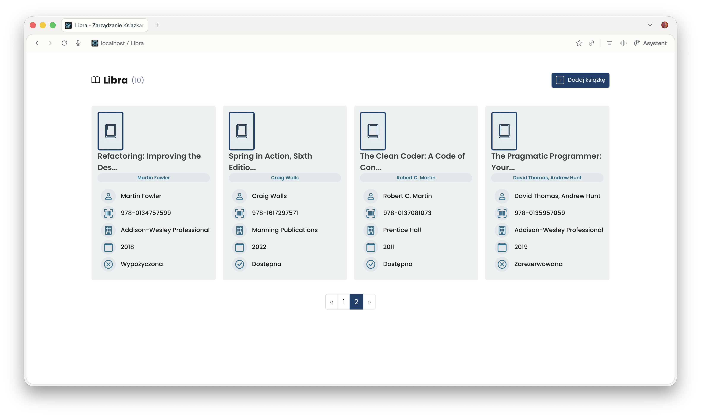

# Libra

## Temat projektu

Libra - system zarządzania domową biblioteką

## Okładka projektu



## Opis projektu

Projekt jest pełnoprawną aplikacją typu full-stack do zarządzania kolekcją książek. Został zbudowany w oparciu o framework Spring Boot 3 po stronie backendu oraz bibliotekę React po stronie frontendu. Aplikacja umożliwia przeglądanie posiadanych zasobów, dodawanie nowych pozycji do bazy danych, edycję szczegółowych informacji o zbiorach oraz zarządzanie grafikami okładek.

## Uruchomienie projektu

Aplikację można uruchomić na dwa sposoby:

### 1. Tryb deweloperski (niezależny)
W tym trybie backend oraz frontend działają jako oddzielne procesy, co ułatwia pracę nad kodem dzięki funkcji automatycznego odświeżania zmian (Hot Reload).

**Backend (API):**
```bash
mvn spring-boot:run
```
Interfejs programistyczny (API) dostępny pod adresem: `http://localhost:8080`

**Frontend:**
W osobnym terminalu przejdź do katalogu `libra-app` i uruchom:
```bash
cd libra-app
npm install  # (tylko przy pierwszym uruchomieniu)
npm start
```
Aplikacja kliencka udostępniona zostanie pod adresem: `http://localhost:3000`

### 2. Tryb zintegrowany (jedna paczka JAR)
W tym trybie aplikacja frontendowa jest kompilowana do postaci statycznej przez `frontend-maven-plugin` i serwowana bezpośrednio przez serwer aplikacyjny Spring Boot.

**Budowanie i uruchamianie:**
```bash
mvn clean package -DskipTests
java -jar target/libraapi-0.0.1-SNAPSHOT.jar
```
Cały system (frontend i backend) będzie dostępny pod adresem: `http://localhost:8080`

## Technologie użyte w projekcie

- Java 21
- Maven
- npm
- Spring Boot 3
- Spring Data JPA
- baza danych H2 (in-memory)
- React 18
- React Router 6
- axios
- Bootstrap Icons

## Autor

Tomasz Gądek
